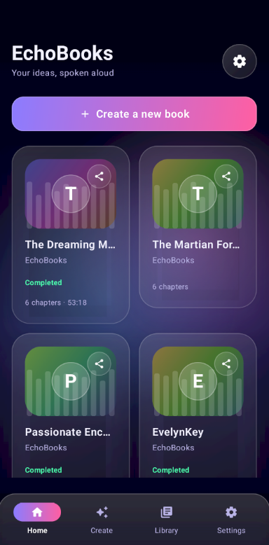
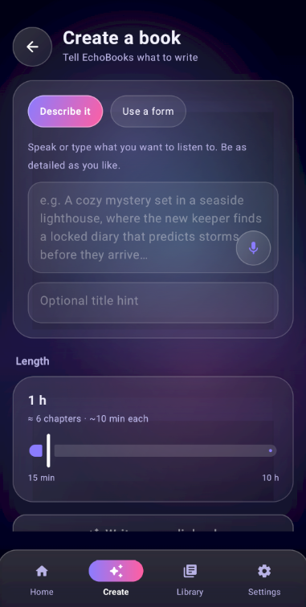
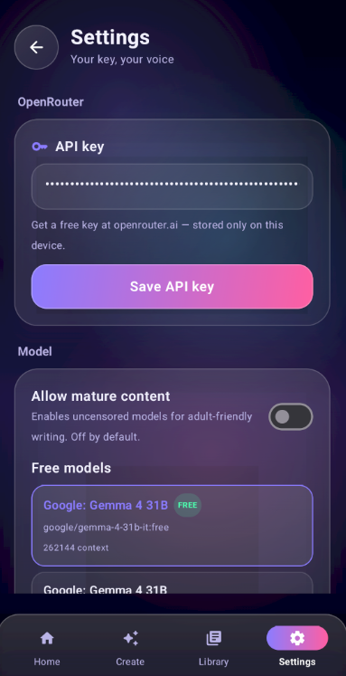

# echo-book

**AI-Powered Audiobook Generator for Android**

[](https://github.com/nagdevAmruthnath/echo-book)
[](LICENSE)
[](https://github.com/nagdevAmruthnath/echo-book)
[](https://kotlinlang.org)
[](https://developer.android.com)

---

## � About this Project

**echo-book** is an Android application that generates audiobooks using OpenRouter AI APIs. Users can describe a story, and the app will write, narrate, and bring it into their library as an audiobook.

The app features four bottom tabs for navigation: **Home**, **Create**, **Library**, and **Settings**. A **Share** function allows sharing books, and a **Delete** affordance removes stale or unwanted books from the library.

### 🔍 Tags: #audiobook #ai #tts #openrouter #android #kotlin #generation #cancel #delete #media

---

## ✨ Key Features

- **AI Story Generation** – Describe a story and let OpenRouter AI generate it chapter by chapter
- **Text-to-Speech** – Narrate generated chapters using device TTS engines (Sherpa ONNX offline)
- **Library Management** – View, delete, and organize generated audiobooks
- **Share Books** – Share generated content via the system share sheet
- **Cancel & Delete** – Always be able to cancel ongoing generation or delete partial/broken books
- **4 Bottom Tabs** – Home, Create, Library, Settings navigation
- **Stable Generation** – Fixed infinite read timeout and coroutine cancellation support

---

## 🛠 Fix: Stuck Generation

This project fixes the critical issue where users **cannot cancel, stop, or delete** stuck/in-progress audiobook generation.

### Root Cause

The original `OpenRouterClient` used `readTimeout(0)` (infinite timeout), causing `readUtf8Line()` to block forever. Coroutine `cancel()` could never interrupt the blocked read, making generation permanently stuck.

### Solution

| File | Fix |
|------|-----|
| `OpenRouterClient.kt` | `readTimeout(0→60s)`, `callTimeout(20min)`, rewritten `streamChat`/`completeChat` with `suspendCancellableCoroutine { cont.invokeOnCancellation { call.cancel() } }` so coroutine cancel instantly aborts the HTTP call |
| `GenerationService.kt` | Separate `cleanupScope` (SupervisorJob + Dispatchers.IO) so cleanup survives service teardown; `fail()` calls `cleanup()` which deletes book row + chapters + `app_books/<id>` dir; notification has "Cancel & delete progress" action |
| `LibraryScreen.kt` + `Books.kt` | `BookCard(book, onClick, onShare, onDelete?)` — red Delete button appears top-left; confirmation dialog → `LibraryViewModel.delete(book)` removes DB row + chapters + audio dir |
| `HomeScreen.kt` / `LibraryScreen.kt` `GenerationBanner` | Close `GlassIconButton` — red "Discard failed generation" in Error phase, neutral "Cancel generation" otherwise |

### How the Fix Works

1. **Timeouts**: Read timeout changed from 0 (infinite) to 60 seconds; call timeout set to 20 minutes
2. **Coroutine Cancellation**: `suspendCancellableCoroutine` + `invokeOnCancellation { call.cancel() }` ensures that when a coroutine is cancelled, the underlying HTTP call is immediately aborted
3. **Cleanup Scope**: Separate `cleanupScope` with `SupervisorJob + Dispatchers.IO` ensures cleanup operations survive service `onDestroy`
4. **Fail Flow**: `fail()` now calls `cleanup()` which immediately sets `bookId=0L` and deletes chapters, bookmarks, and the `app_books/<id>` directory
5. **Notification Action**: The foreground service notification includes a "Cancel & delete progress" PendingIntent that triggers the same cleanup flow

### Usage After Fix

- **Long-press any book card in Library** → red Delete button appears top-left → confirm dialog → book and all associated files permanently removed
- **During generation**, tap the Cancel button in GeneratingScreen, or use the "Cancel & delete progress" notification action, or tap the banner Close button to abort and clean up
- **Create a book** → Tap "Create a book" → Describe your story → Set length → Tap "Write my audiobook"
- **Share a book** → Long-press any book card → Tap Share → System share sheet appears

---

## 📱 How to Use

- **Long-press any book card in Library** → red Delete button appears top-left → confirm dialog → book and all associated files permanently removed
- **During generation**, tap the Cancel button in GeneratingScreen, or use the "Cancel & delete progress" notification action, or tap the banner Close button to abort and clean up
- **Create a book** → Tap "Create a book" → Describe your story → Set length → Tap "Write my audiobook"
- **Share a book** → Long-press any book card → Tap Share → System share sheet appears

---

## 📸 Screenshots



*Home screen with 4 bottom tabs and book cards showing Delete buttons*



*Create screen for describing a new story*



*Settings screen with generation parameters*

---

## 💻 Technical Details

- **Minimum SDK:** Android 21 (Android 5.0)
- **Target SDK:** Android 33
- **Language:** Kotlin 1.9.x
- **Build System:** Gradle
- **Dependencies:**
  - OpenRouter AI API client
  - Androidx Material3 / Compose UI
  - Sherpa ONNX TTS offline engine
  - Kotlin coroutines & flow

### Repository Structure

```
echo-book/
├── app/                    # Android module
│   ├── src/main/java/      # Kotlin source files
│   ├── src/main/res/       # Android resources
│   └── AndroidManifest.xml
├── TECHNICAL.md            # Detailed technical documentation
├── build.gradle.kts        # Project build configuration
├── settings.gradle.kts     # Gradle subprojects
├── gradle.properties       # Gradle properties
├── local.properties        # Local configuration
└── README.md               # This file
```

---

## 📄 License

This project is licensed under the **MIT License** – see the [LICENSE](LICENSE) file for details.

---

## 📬 Contact

- **GitHub:** [@nagdevAmruthnath](https://github.com/nagdevAmruthnath)
- **Project:** [echo-book](https://github.com/nagdevAmruthnath/echo-book)

---

## 📥 Download APK

**Release v1.2.0** is available for download:

[](https://github.com/nagdevAmruthnath/echo-book/releases/download/v1.2.0/EchoBooks-v1.2.0-release.apk)

*Android 5.0+ • Kotlin 1.9 • Generated with OpenRouter AI • Cancel & Delete enabled*

---